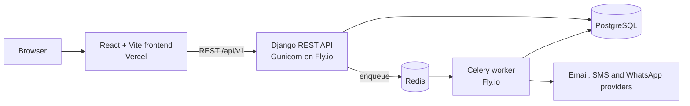

# Senet

[](https://github.com/Susan-hue/senet/actions/workflows/ci.yml)

A multi-tenant academic operations platform for Nigerian universities. Senet takes a result from a lecturer's score sheet through departmental, faculty and Senate approval, computes GPA and CGPA from the ratified record, and runs the coursework, computer-based tests and course delivery that feed it.

**Live:** [senet-pi.vercel.app](https://senet-pi.vercel.app) · **API:** [senet-backend-jnb.fly.dev](https://senet-backend-jnb.fly.dev/)

## What it does

| Area | What it covers |
| --- | --- |
| **Tenancy and access** | One deployment serves many institutions. Each carries its own grade scale, CA/exam weights, pass mark and classification bands. Role-and-scope access control covers ten roles, from student and lecturer to HOD, Dean and Senate administrator. |
| **Results pipeline** | A five-state approval chain: draft → submitted to HOD → approved by HOD → approved by Dean → ratified by Senate, with a `returned` state that requires a reason. Amendments to ratified results run their own approval chain. |
| **Grading engine** | Quality-points GPA and CGPA in `Decimal` with explicit rounding, both carryover methods, degree classification and academic standing. |
| **Assessments** | Continuous assessment items, student submissions, lecturer grading and weighted aggregation into the result. |
| **Computer-based tests** | Question banks, per-student papers frozen at start, server-side timing, resume after disconnection, auto-submit at the deadline and review-only proctoring flags. |
| **Course delivery** | Course modules and learning content, announcements and discussion boards. |
| **Exports** | Official Grade Report as an encrypted PDF and the class broadsheet as an `.xlsx` workbook, generated on a worker for large classes. |
| **Auditor vault** | Temporary, revocable, read-only access tokens for external NUC auditors, with every access logged. |
| **Notifications** | Email, SMS and WhatsApp behind one provider interface, always sent asynchronously, plus an SMS/USSD result check for students without data. |

The full design notes for each module are in [`backend/README.md`](backend/README.md).

## Architecture



## Tech stack

| Layer | Tools |
| --- | --- |
| **Backend** | Python 3.12, Django 5, Django REST Framework, SimpleJWT, Celery |
| **Data** | PostgreSQL in staging and production, SQLite for local development, Redis as the Celery broker |
| **Frontend** | React 19, TypeScript, Vite, React Router, Vitest |
| **Infrastructure** | Docker, Fly.io (API and worker), Vercel (frontend) |
| **CI/CD** | GitHub Actions |
| **Code quality and security** | Ruff, Bandit, Gitleaks, ESLint, Prettier, pre-commit |

## Engineering highlights

- **Tenant isolation by construction.** Every tenant-owned model inherits from `tenancy.scoping.TenantScopedModel`, and the default manager is scoped to the current institution. A query that bypasses scoping has to ask for it explicitly.
- **Results that cannot be rewritten.** Score rows are append-only after submission. PostgreSQL triggers enforce score immutability and an append-only audit log below the ORM, so no code path or manual `UPDATE` can change history.
- **One table of legal transitions.** Every allowed move in the approval chain is listed once with its required role and scope. Anything not listed is rejected, so a state cannot be skipped.
- **Exams that survive bad connections.** Timing is server-side, the drawn paper is frozen on the attempt, and a disconnected student resumes the same paper against the original deadline.
- **No request waits on a provider.** Notifications are written to an append-only log and handed to Celery when the transaction commits. Failures retry with exponential backoff.

## CI/CD

Every pull request and every push to `main` runs three jobs:

| Job | Steps |
| --- | --- |
| **backend** | Ruff lint, Ruff format check, Bandit security scan, Django test suite against a PostgreSQL 16 service |
| **frontend** | ESLint, Prettier check, TypeScript typecheck, production build |
| **secret-scan** | Gitleaks over the full history |

When CI passes on `main`, the deploy workflow ships the API and the Celery worker to Fly.io as two separate apps. `main` is protected and changes land through pull requests. The same Ruff, Bandit and Gitleaks checks run locally through pre-commit.

## Repository layout

```
senet/
├── backend/               Django project
│   ├── tenancy/           institutions and the tenant scoping layer
│   ├── accounts/          users, roles, academic structure, bulk imports
│   ├── assessments/       continuous assessment and grading
│   ├── results/           approval pipeline, audit log, exports
│   ├── grading/           GPA/CGPA engine and academic standing
│   ├── cbt/               computer-based test engine and proctoring
│   ├── content/           course modules and learning material
│   ├── announcements/     course announcements
│   ├── discussions/       course discussion boards
│   ├── auditor/           NUC auditor vault
│   ├── notifications/     email, SMS, WhatsApp and the result check
│   ├── Dockerfile
│   ├── fly.toml           API app
│   └── fly.worker.toml    Celery worker app
├── frontend/              React + TypeScript client
└── .github/workflows/     CI and deploy pipelines
```

## Run it locally

### Backend

```bash
cd backend
python -m venv .venv && source .venv/bin/activate
pip install -r requirements.txt -r requirements-dev.txt
cp .env.example .env
```

In `.env`, set `DEBUG=True` and leave `DATABASE_URL` empty. The backend then uses SQLite and runs background jobs inline, so you need neither PostgreSQL nor Redis.

```bash
python manage.py migrate
python manage.py test
python manage.py runserver        # http://localhost:8000
```

### Frontend

```bash
cd frontend
npm install
cp .env.example .env              # set VITE_API_URL=http://localhost:8000
npm run dev                       # http://localhost:5173
```

## Status

The backend modules listed above are implemented and covered by more than 500 tests. The frontend covers authentication, the admin console, score sheets, the HOD, Dean and Senate approval boards, assessments, student results and course pages.

Still to come: the frontend for computer-based tests, an analytics dashboard, load testing and a pilot deployment.

## Author

Built by [Susan Amechi](https://github.com/Susan-hue).
